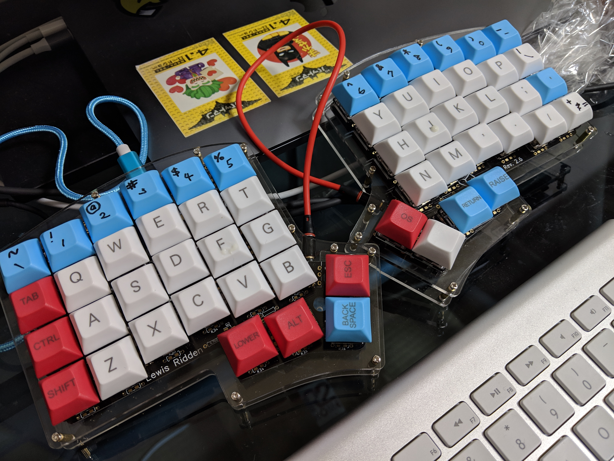
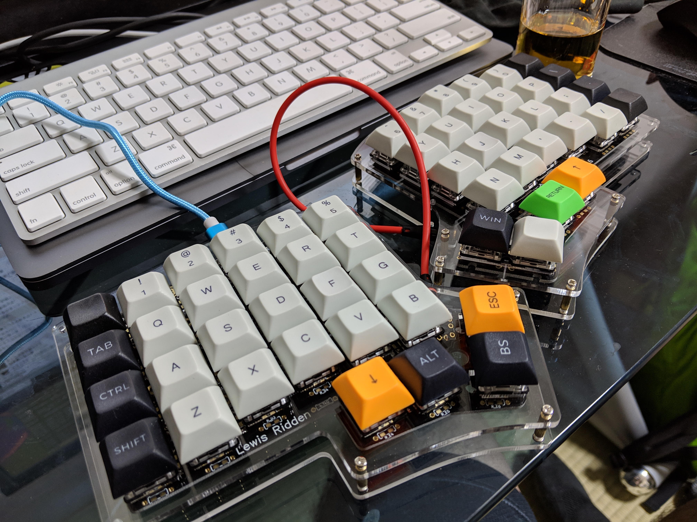
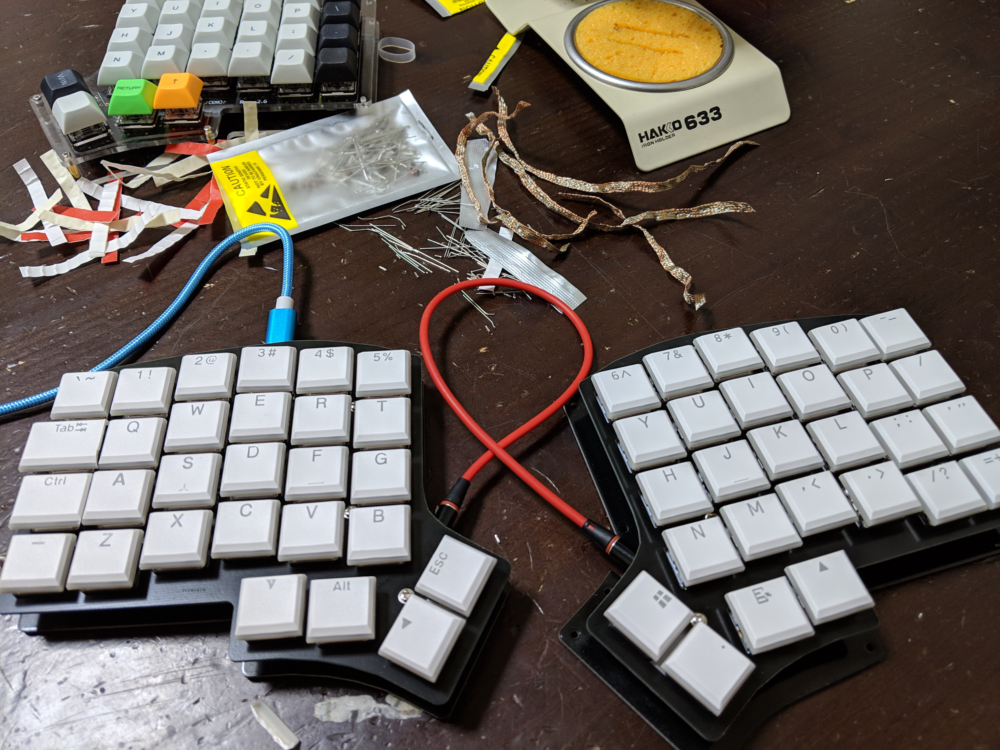
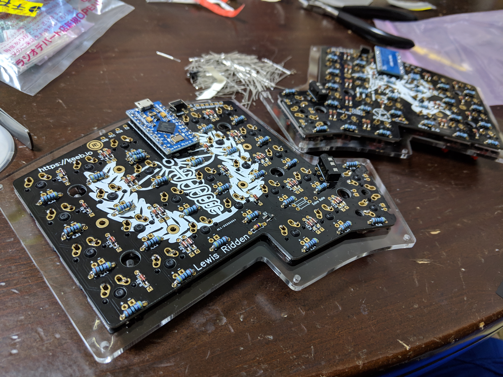

Iris build log
##############

Build firmware::

  $ git clone git://github.com/qmk/qmk_firmware.git
  $ cd qmk_firmware
  $ make submodule
  $ make iris/rev2:avrdude

avr-gcc 8.2.0 has a bug: https://github.com/qmk/qmk_firmware/issues/3657

The workaround is build the firmware in some container such as Docker,
and write the firmware by yourself, not using make command::

  $ ls /dev/tty.usbmodem*
  tty.usbmodem1432301
  $ avrdude -p atmega32u4 -c avr109 -P /dev/tty.usbmodem1432301 -U flash:w:iris_rev2_default.hex

Make sure you have ``iris_rev2_default.hex`` in the current
directory. Maybe you might have to reset the Pro Micro by
shorting the ``RST`` and ``GND``.

Built without LED
=================

All below was made with `this Pro Micro
<https://www.aliexpress.com/item/Free-Shipping-New-Pro-Micro-for-arduino-ATmega32U4-5V-16MHz-Module-with-2-row-pin-header/2021987137.html?spm=a2g0s.9042311.0.0.34124c4diC0nIN>`_
which seem very stable. Also I bought `cherry mx compatible switch <https://www.aliexpress.com/item/Gateron-mx-switch-3-pin-and-5-pin-transparent-case-mx-green-brown-blue-switches-for/32835653175.html?spm=a2g0s.9042311.0.0.27424c4d7W0QUU>`_ , red and clear.

https://www.instagram.com/p/Bq5P7nDANwt/

https://www.instagram.com/p/BrDYypKAexl/

- Keycaps : https://www.aliexpress.com/item/DSA-50-dye-sub-keycaps-for-cherry-mx-switch/32879946574.html

Low Profile
===========

- `Lessons learned <https://www.instagram.com/p/Brxmfixg7wA/>`_
- `Low profile key switches <https://www.aliexpress.com/item/kailh-low-profile-switch-half-high-ultrathin-RGB-Swithes-For-Backlit-Mechanical-Gaming-keyboard-brown-white/32838369089.html?spm=a2g0s.9042311.0.0.34124c4diC0nIN>`_
- `Low profile keycaps <https://www.aliexpress.com/item/kailh-choc-low-profile-keycap-set-for-kailh-low-profile-swtich-abs-doubleshot-ultra-thin-keycap/32915900901.html?spm=a2g0s.9042311.0.0.34124c4diC0nIN>`_

Lighting with LED
=================

`Iris originally requires <https://keeb.io/products/iris-keyboard-split-ergonomic-keyboard?variant=8034004860958>`_ ::

  Optional - LED support components

    2 AO3416 MOSFETs
    2 4.7kΩ resistors

  Optional - LEDs and 470Ω resistors

But they're not included in the kit so I seeked for them in Akihabara, in 2018/12/28 . And found:

- 100PCS 1/4w 470Ω resistors 金属被覆 @ 300JPY x2
- 10PCS Nch MOSFET IRFML8244TRPBFTR @ 160JPY
- 10PCS Nch MOSFET IRLML6344TRPBFTR @ 240JPY
- `10PCS 角形2.3.4 赤色LED 輝度:1000～1500mcd 指向角:120° 波長:625～630nm 順電圧:1.9～2.3V 順電流:30mA <https://www.sengoku.co.jp/mod/sgk_cart/detail.php?code=EEHD-00GP>`_ @ 500JPY
- 10PCS 角形2.3.4 白色LED 輝度:1000～1500mcd 指向角:120° 波長:590～595nm 順電圧:1.9～2.3V 順電圧:30mA @ 500JPY
- 10PCS 角形2.3.4 青色LED 輝度:1000～1500mcd 指向角:120° 波長:590～595nm 順電圧:1.9～2.3V 順電圧:30mA @ 500JPY
- `10PCS 角形2.3.4 緑色LED 輝度:1000～1500mcd 指向角:120° 波長:590～595nm 順電圧:1.9～2.3V 順電圧:30mA <https://www.sengoku.co.jp/mod/sgk_cart/detail.php?code=EEHD-00GS>`_ @ 500JPY

First Combination I tried was:

- 1/4w 470Ω resistors 金属被覆
- Nch MOSFET IRFML8244TRPBFTR
- 角形2.3.4 緑色LED

The LED lighted but not that bright and hard to recognize even in
darkness. So I doubted the MOSFET as it's different from required one,
and changed to Nch MOSFET IRLML6344TRPBFTR - but didn't worked well
thought the key typing itself worked very fine.

On 2018/12/30 I tried buying `another LED
<https://www.sengoku.co.jp/mod/sgk_cart/detail.php?code=EEHD-00GS>`_
::

  順電圧:3.0～3.4V
  順電流:20mA
  1500～2500mcd
  指向角:120°
  波長:515～521nm

But it didn't worked. The reason was that there wasn't enough current
provided to LED. `The old Iris build guide <https://docs.keeb.io/iris-build-guide-archive/#solder-led-support-components-40optional41>`_ says::

  470Ω resistors are commonly used, but this value might vary, based
  on the LEDs you use and the amount of current they draw.

Also `Iris rev2.5 ビルドメモ
<https://qiita.com/natten/items/95a57ee77e1e66ba88e6>`_ uses 4.7Ω (
RK73H2ATTD471F ) for LED resistors...

But how much? What to buy???

- https://www.reddit.com/r/MechanicalKeyboards/comments/7lihur/help_questions_about_smd_leds_for_an_iris/drmkras/
- https://www.reddit.com/r/MechanicalKeyboards/comments/7evx0x/iris_keyboard_with_led_backlighting/
- Calculator https://www.digikey.com/en/resources/conversion-calculators/conversion-calculator-led-series-resistor
- Example Calculation https://www.reddit.com/r/MechanicalKeyboards/comments/7evx0x/iris_keyboard_with_led_backlighting/dq7v7y0/

Wrist Rest
==========

https://www.instagram.com/p/Br2C0N5gomw/

References
==========

- `Iris rev2.5 ビルドメモ <https://qiita.com/natten/items/95a57ee77e1e66ba88e6>`_
